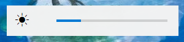

# Monitor Brightness Control



Python app for Windows that controls monitor brightness with keyboard shortcuts. Works directly with your monitors through DDC/CI.

Uses DDC/CI protocol to talk directly to your monitor hardware. Gets monitor names from Windows WMI. The brightness slider shows up near the bottom center of your screen for a few seconds when you adjust brightness.

## Table of Contents
- [Features](#features)
- [Requirements](#requirements)
- [How to use](#how-to-use)
- [Settings](#settings)
- [Troubleshooting](#troubleshooting)
- [Tech stuff](#tech-stuff)
- [Credits](#credits)
- [Notes](#notes)

## Features

- Control brightness with hotkeys (default: Ctrl+Up/Down)
- Customize shortcuts in a JSON file
- Shows a popup when you change brightness
- Sits in your system tray
- Works with multiple monitors
- Follows Windows dark/light theme

## Requirements

- Windows 10 or 11
- Python 3.7+
- Monitors that support DDC/CI (most modern monitors do)

Install stuff:
```bash
pip install keyboard pillow pystray monitorcontrol
```

## How to use

1. Download and run `monitor_brightness_control.pyw`
2. First time it runs, it creates a `settings.json` file
3. Use Ctrl+Up/Down to change brightness (or whatever you set in settings)
4. Right-click tray icon to toggle monitors or change settings

## Settings

### Editing settings the easy way

Right-click the tray icon → "Open settings.json" → edit in Notepad → save and close. The app will reload the settings automatically.

### Configuration file structure

Edit `settings.json` to change hotkeys. The file looks like this:
```json
{
    "hotkeys": {
        "increase_brightness": {
            "key": "up",
            "modifier": "ctrl"
        },
        "decrease_brightness": {
            "key": "down",
            "modifier": "ctrl"
        }
    },
    "monitor_states": []
}
```

You can change the keys to whatever you want. For example:
```json
{
    "hotkeys": {
        "increase_brightness": {
            "key": "up",
            "modifier": "alt"
        },
        "decrease_brightness": {
            "key": "down",
            "modifier": "alt"
        }
    },
    "monitor_states": []
}
```

### ⚠️ Warning

**Be careful editing the JSON file!** 

The app doesn't check if you messed up the format. If you break the JSON structure or use invalid key names, it'll print error messages to the console (if you're running the .py file). Keep a backup of the working file before you start experimenting.

If something breaks, just delete `settings.json` and restart - it'll make a new one with defaults.

## Troubleshooting

**No monitors found?**
- Make sure DDC/CI is enabled in your monitor settings (usually in the OSD menu)
- Some cheap cables don't support DDC/CI
- Try running as administrator

**Hotkeys not working?**
- Check if your JSON is valid
- Restart the app after changing settings

**App won't start?**
- Delete `settings.json` and try again
- Check if you installed all the Python packages

## Credits

Built with these libraries:
- [monitorcontrol](https://github.com/newAM/monitorcontrol) - for DDC/CI communication
- [pystray](https://github.com/moses-palmer/pystray) - system tray stuff
- [keyboard](https://github.com/boppreh/keyboard) - global hotkeys
- [pillow](https://github.com/python-pillow/Pillow) - icons and images

## Notes

This directly controls monitor hardware, so use common sense. I've been using it for few days without issues, but your mileage may vary.

The `monitor_states` array in the JSON gets filled automatically based on how many monitors you have. Don't mess with it unless you know what you're doing.

Feel free to report bugs or give feedback if something doesn't work right!

